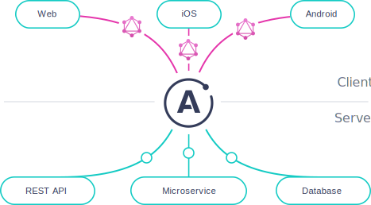

<h2 align="center">
	
</h2>

<p align="center">
	<a href="mailto:bortolettohenrique@gmail.com" target="_blank">
		
	</a>
	<a href="https://www.linkedin.com/in/henriquebortoletto/" target="_blank">
		
	</a>
</p>

---

## 🚀 Sobre

Esse é um repositório de estudo de `graphql` utilizando `apollo` como base para criação de uma api `graphql`.

- [x] Schema e Queries
- [ ] Mutations
- [ ] Banco de dados e graphql
- [ ] Backend com graphql
- [ ] Frontend com Apollo Client

---

## 🪛 Instalação

Para rodar o repositório instale as dependencias com o comando abaixo.

```bash
# install dependencies
yarn add
```

Inicialize a api com o comando abaixo, o servidor será levantado na porta padrão do apollo `http://localhost:4000`

```bash
# running api graphql
yarn start
```

---

## 🧑‍💻 Tecnologias

- [x] [Graphql](https://graphql.org/)
- [x] [Apollo Server](https://www.apollographql.com/docs/)
- [x] [NodeJS](https://nodejs.org/en/)
- [x] [Yarn](https://yarnpkg.com/)
- [x] [Husky](https://typicode.github.io/husky/#/)
- [x] [Conventional Commit](https://github.com/conventional-changelog/commitlint)

---

by [Henrique Bortoletto](https://github.com.br) :wave:
